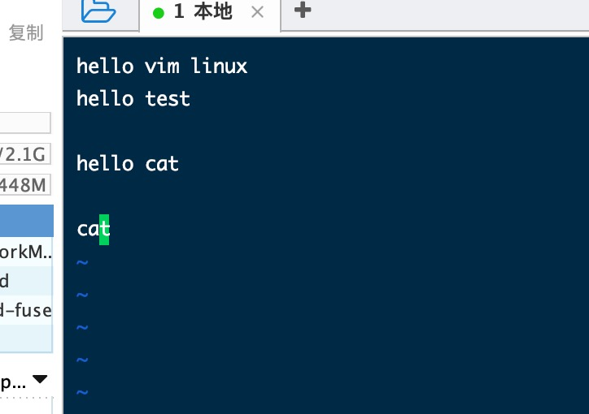
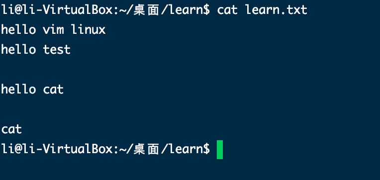
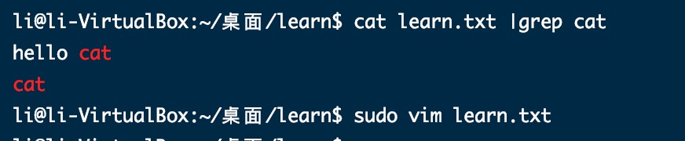
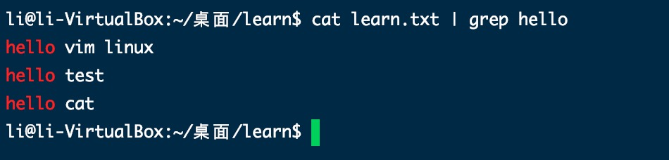

1. cat 打开文件，只读的不能编辑

2. vi/vim 打开或创建文件打开，能够编辑

3. 实例，

   加入当前有一个文件learn.txt ，里面内容如下：

        sudo vim learn.txt
    
    

+ 查看文件中的内容

        cat learn.txt

   

+ 打开文件查找文件中cat

        cat learn.txt | grep cat

   

+ 打开文件查找文件中hello

   

