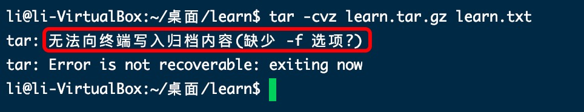

1. tar 解/压缩 .tar 类型的文件

+ -c : 创建，即压缩，把文件打包成 .tar 类型的文件

        tar -cvf learn.tar learn.txt // 压缩

+ -v : 显示详细的tar处理的文件信息

+ -f : 要操作的文件名, ***不能省略,且放在最后一个位置***

   

   

+ -x: 解压缩，把.tar 类型的文件解压

        tar -xvf learn.tar // 解压缩

2. -z 解/压缩 .tar.gz 类型的文件

        tar -czvf learn.tar.gz learn.txt // 压缩

        tar -xzvf learn.tar.gz  // 解压缩

3. 总结

        总结
        1、*.tar 用 tar -xvf 解压
        
        2、*.gz 用 gzip -d或者gunzip 解压

        3、*.tar.gz和*.tgz 用 tar -xzf 解压

        4、*.bz2 用 bzip2 -d或者用bunzip2 解压

        5、*.tar.bz2用tar -xjf 解压

        6、*.Z 用 uncompress 解压

        7、*.tar.Z 用tar -xZf 解压

        8、*.rar 用 unrar e解压

        9、*.zip 用 unzip 解压