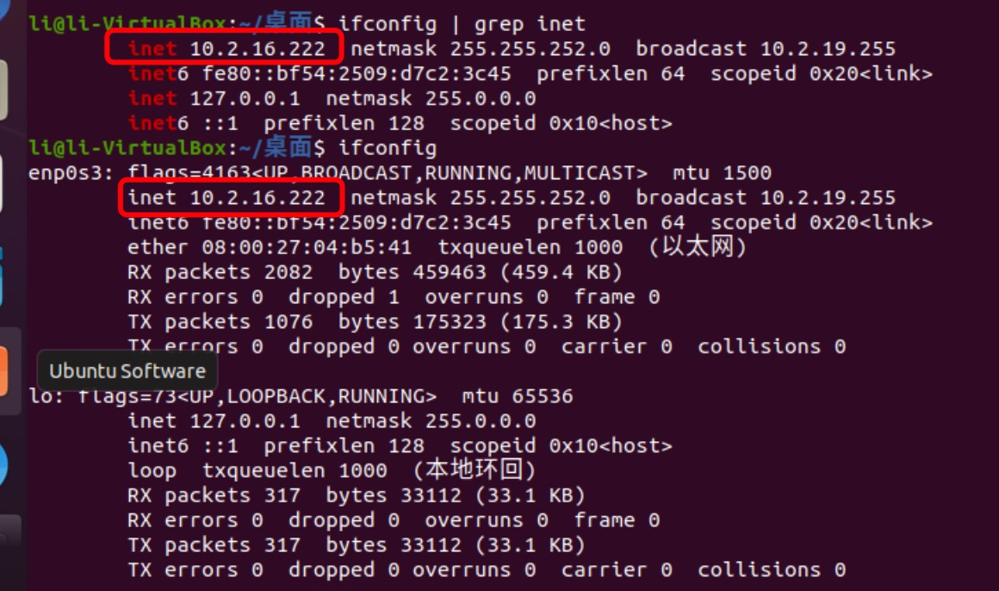
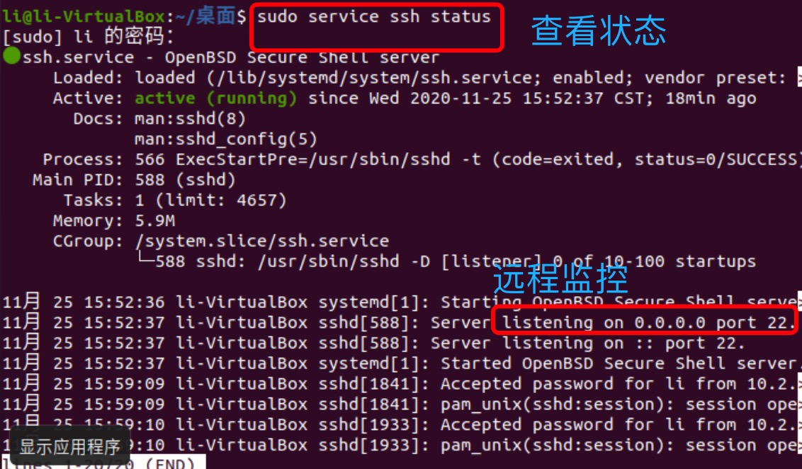
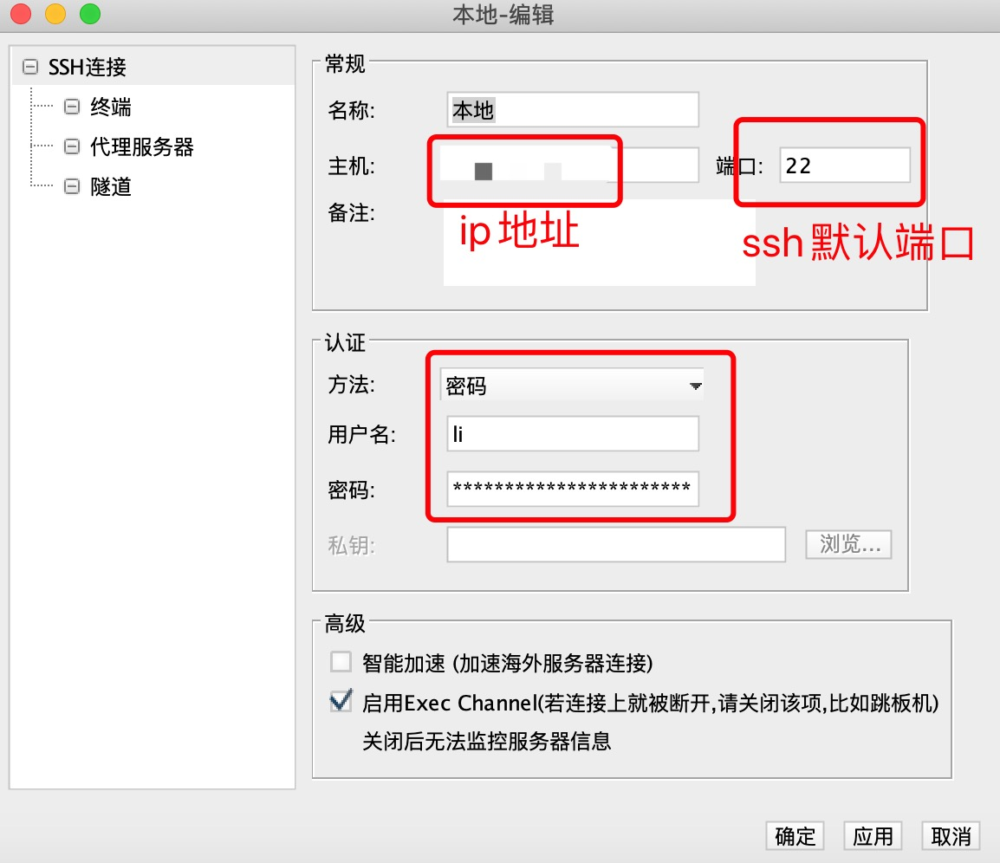
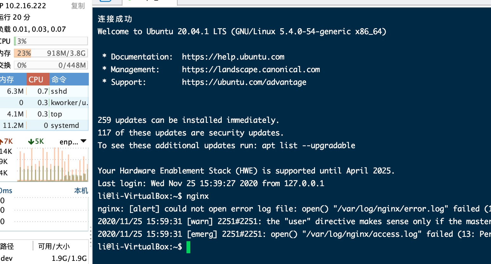

1. 虚拟机连接使用桥接网络模式

2. 查看ip 地址

   ifconfig | grep inet

   
   
3. ubuntu desktop 默认不安装ssh

       sudo apt-get install ssh

4. 修改ssh配置文件

        sudo vim /etc/ssh/sshd_config

        :set nu (显示行号)

        查找PermitRootLogin 该为yes

5. 重启ssh

        sudo service ssh restart

        查看状态

        sudo service ssh status

   

6. 连接

   
   