1. 启动virtualBox 

   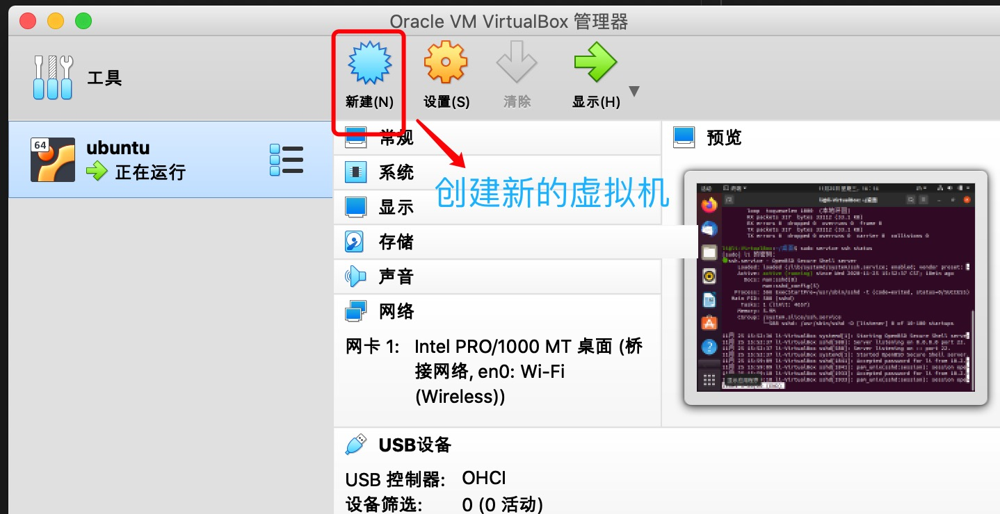

2. 填写虚拟机名称和虚拟机操作系统类型

   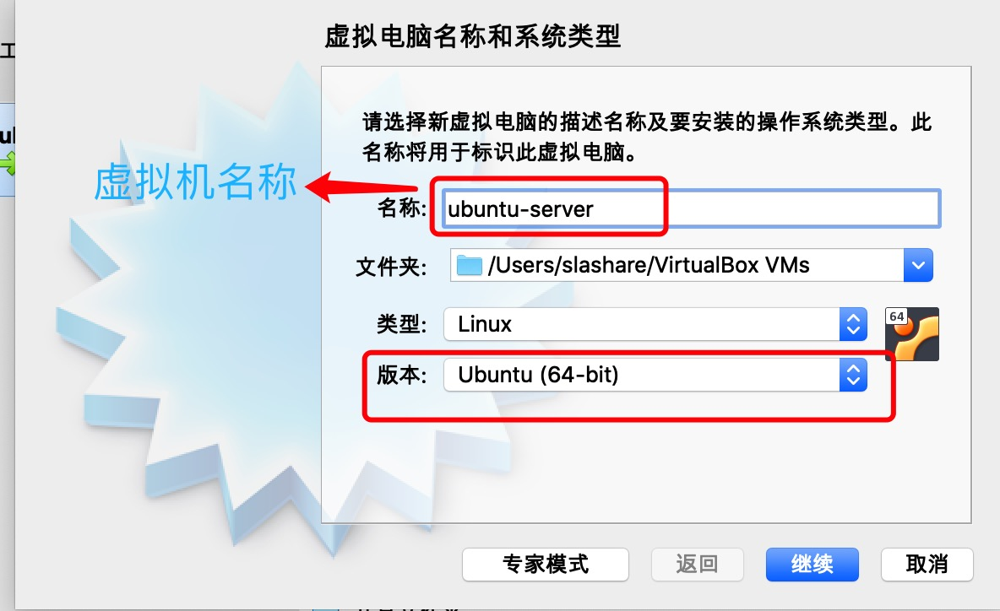

3. 选择虚拟机内存大小

   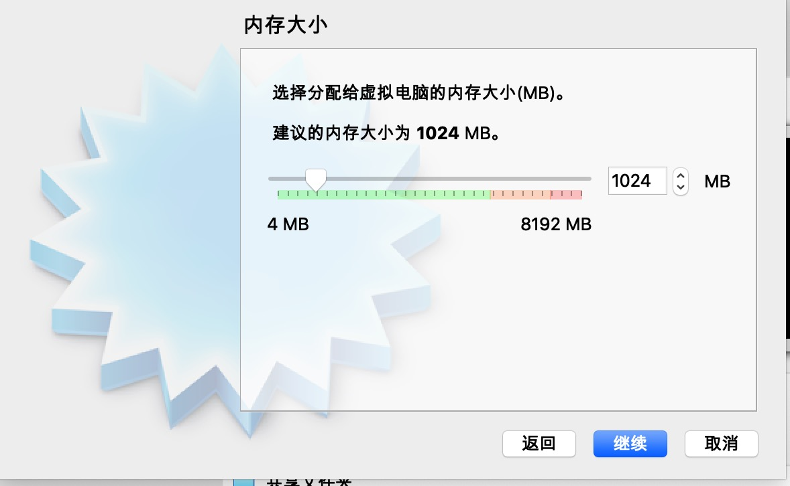

4. 选择创建虚拟硬盘

   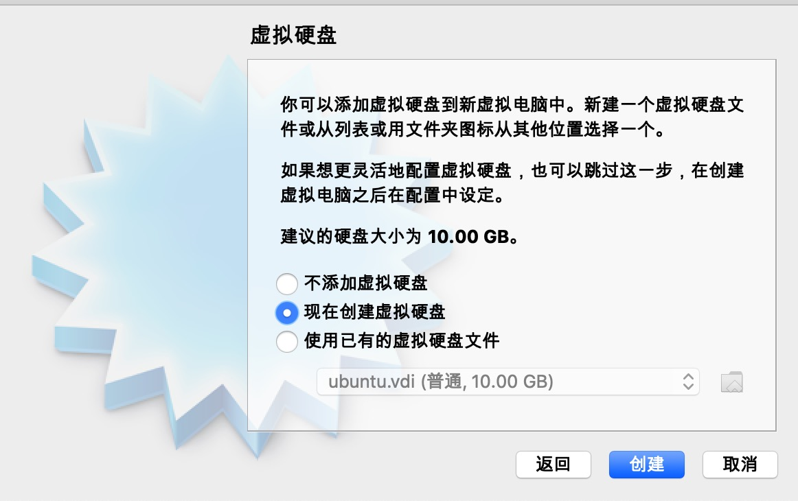

5. 选择虚拟硬盘类型

   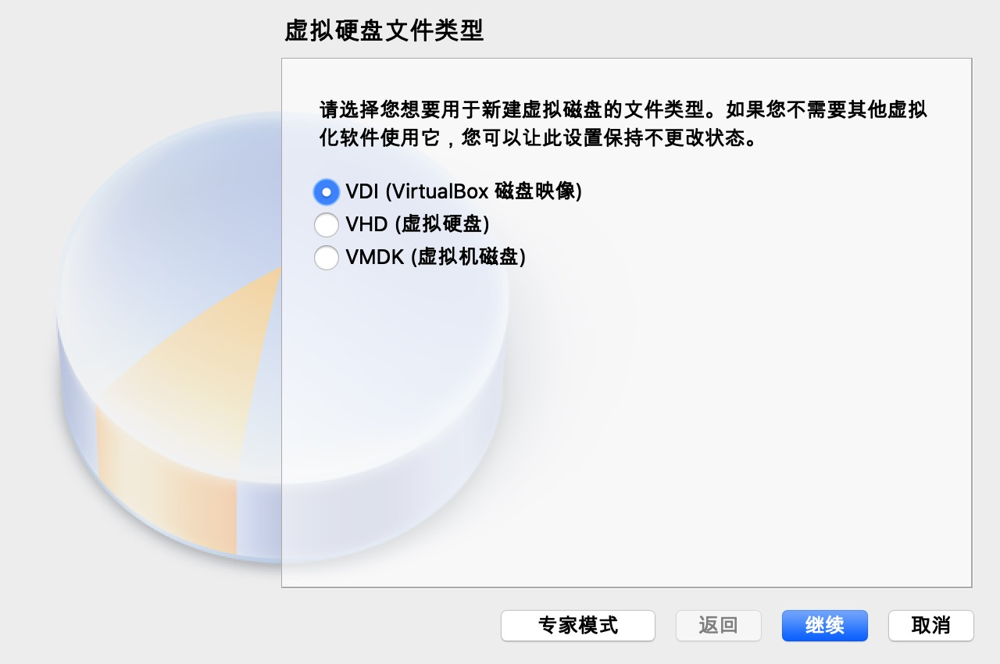

6. 虚拟硬盘大小

   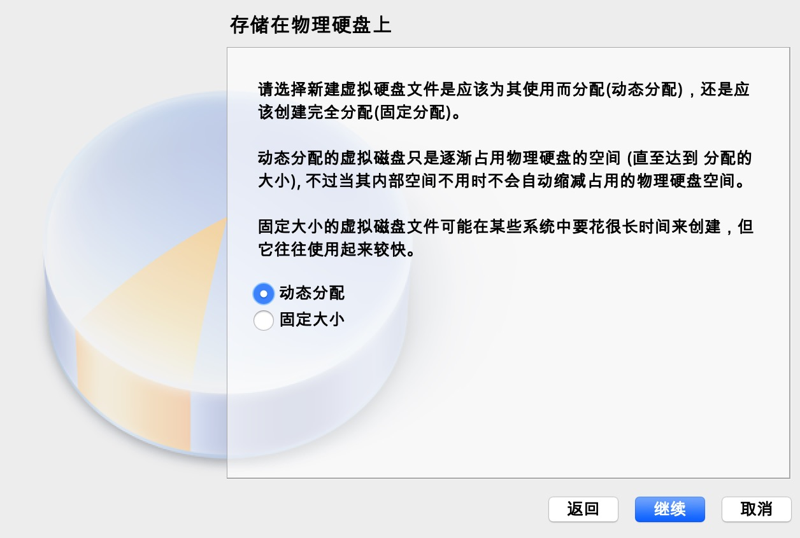

7. 硬盘文件位置

   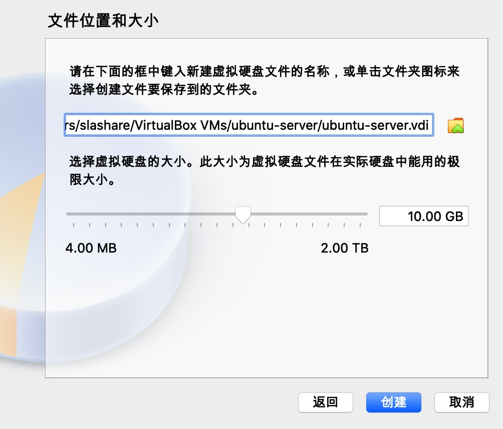

8. 创建完毕

   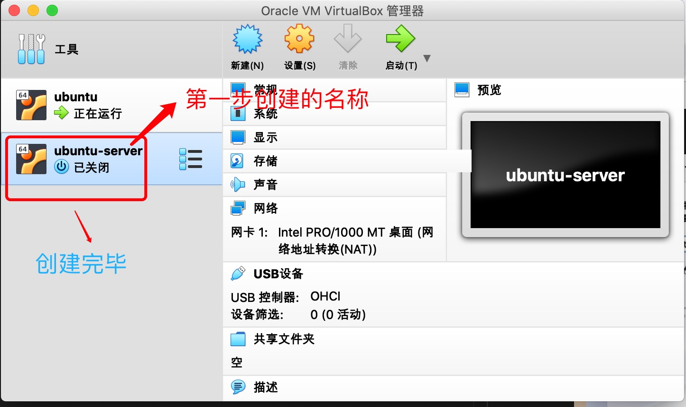

9. 打开

   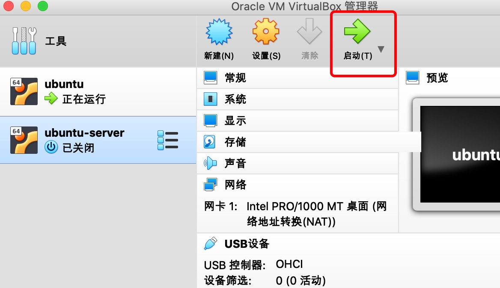

10. 选择已下载好的ubuntu server iso 文件

    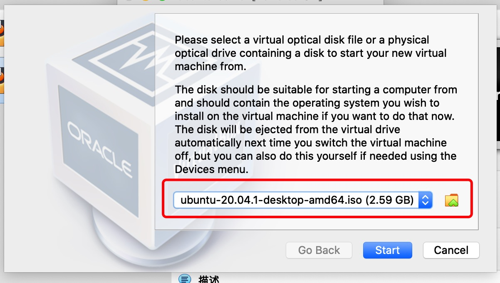

11. 安装ubuntu 系统

    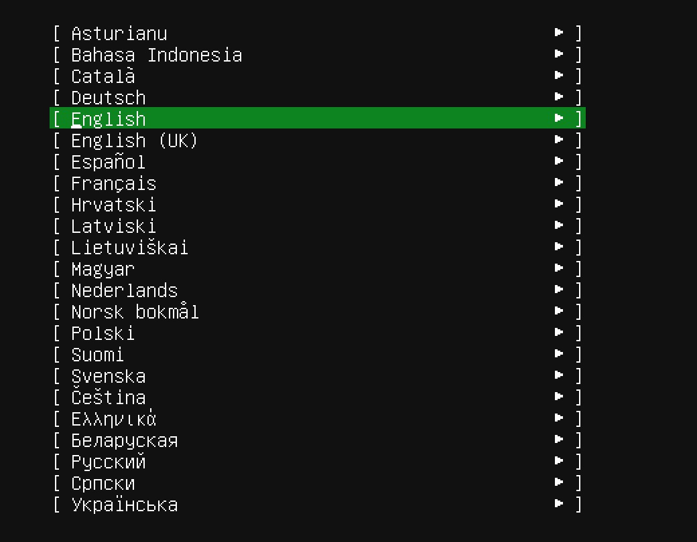